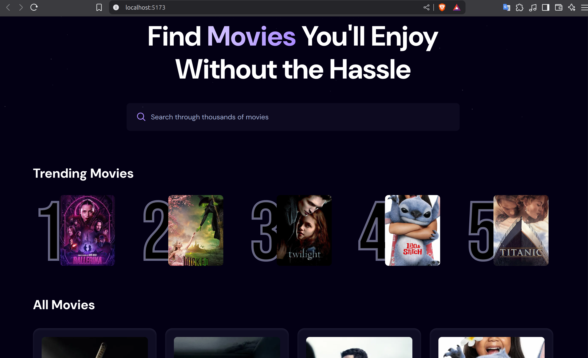

# 🎬 Movie Finder Web App



A modern, responsive **movie search web application** built using **React.js**, **Tailwind CSS**, and **Vite**. It allows users to search for movies and view their details using the **TMDB (The Movie Database) API**.

## 🔥 Trending Movies

In addition to standard search, the app features a **Trending Movies** section. It uses **Appwrite** to simulate a backend database by recording how many times each movie has been searched. Trending movies are determined by their search frequency, offering a dynamic way to explore popular films within the app.

## 🔍 Overview

Simply type the name of any movie into the search bar and instantly get results including:

- 🎞️ Movie titles  
- 🗓️ Release dates  
- 📝 Brief descriptions  
- 🖼️ Movie posters  
- 📈 Trending metrics based on user searches

## 🚀 Technologies Used

- **React.js** – For building the user interface  
- **Tailwind CSS** – For responsive, utility-first styling  
- **Vite** – For fast development and optimized builds  
- **TMDB Web API** – For real-time movie data  
- **Appwrite** – To track and simulate trending movie search data

## 🌐 Live Demo

*Coming soon or [add your deployed link here](#)*

## 🧑‍💻 Getting Started

1. **Prerequisites**  
   - Node.js v14+  
   - A TMDB API key (get one from [TMDB Developer Portal](https://developer.themoviedb.org/))  
   - An Appwrite account and project (see [Appwrite.io](https://appwrite.io))

2. **Installation**  
   Clone the repo and install dependencies:

    ```bash
    git clone https://github.com/raquelvencovsky/movie-finder.git
    cd movie-finder
    npm install
    ```

3. **Configure Environment Variables**  
   Create a `.env` file in the root of your project and add:

    ```env
    VITE_TMDB_API_KEY=your_tmdb_api_key_here
    VITE_APPWRITE_PROJECT_ID=your_appwrite_project_id
    VITE_APPWRITE_DATABASE_ID=your_appwrite_database_id
    VITE_APPWRITE_COLLECTION_ID=your_appwrite_collection_id
    ```

4. **Run the Web App Locally**  
   Start the development server:

    ```bash
    npm run dev
    ```

   The app will be available at [http://localhost:5173](http://localhost:5173)

## ⚙️ Build for Production

To create an optimized build:

```bash
npm run build
